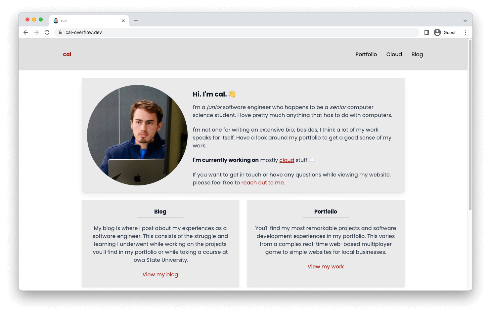
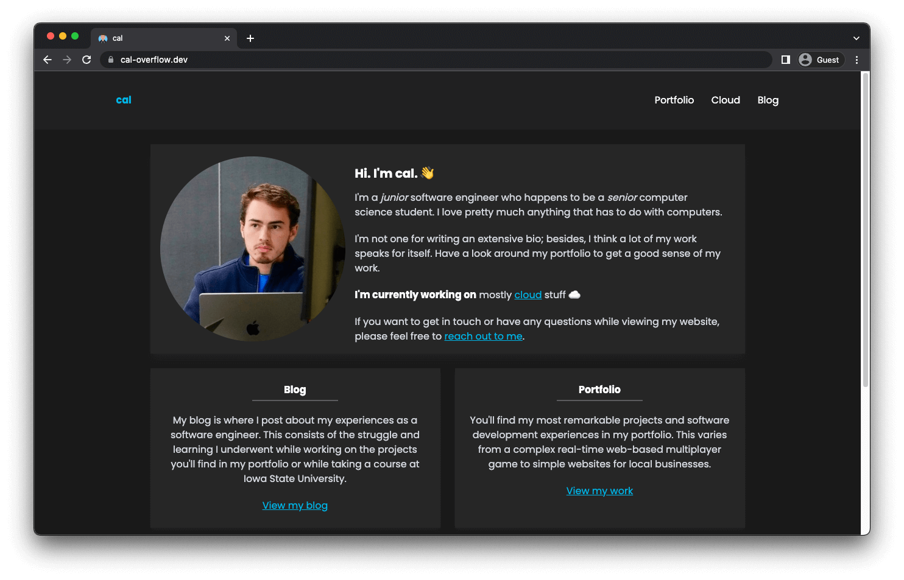

# Portfolio

A template website for blogging and showcasing work. \
Built primarily with [NuxtJS](https://nuxtjs.org/) and [TailwindCSS](https://tailwindcss.com/).

<details>

<summary>Click here to see an example (<a href="http://www.cal-overflow.dev">cal-overflow.dev</a>)</summary>

View the source code for the website [here](https://github.com/cal-overflow/site)
#### Light mode
[](http://www.cal-overflow.dev)

#### Dark mode
[](http://www.cal-overflow.dev)

</details>

<!-- Table of contents -->
### Table of contents
- [Getting Started](#make-the-site-your-own-)
- [Project Overview](#project-overview)
  - [Sections](#sections)
  - [Views](#views)
  - [Posts](#posts-)
  - [Tags](#tags)
<!--
- [Running locally](#running-locally) 
  - [Environment setup](#environment-setup)
  - [Environment variables](#environment-variables)
  - [Run or generate the website](#run-or-generate-the-website)
  - [Testing](#testing-)
-->

## Getting Started
**Make the site your own 👨‍💻** \
This portfolio is "modular" so that the content and site structure is separate from the components themselves.

If you'd like a website similar to the author's ([cal-overflow.dev](http://www.cal-overflow.dev)), you can create one without needing to build it from scratch. 

**[Click here to get started](./getting-started.md)**

---

## Structure Overview
A high-level overview of how the website is structured. The different pieces involved are:
- [Sections](#sections)
- [Views](#views)
- [Posts](#posts)
- [Tags](#tags)

---

### Sections
Sections are defined as folders within the `src/content` folder. For instance, creating a `src/content/blog` folder will define a blog section within your website. **Each section must include an `index.md` defining metadata for the section.**

#### Metadata
##### Required
1. A title for the section
1. A `primaryView` in which to render for the section's default route (i.e., `/blog/` for `src/content/blog/index.md`)
1. A `secondaryView` in which to render for the section's default route (i.e., `/blog/post-1` for `src/content/blog/post-1.md`)

See more information on [views](#views) below.


##### Optional
1. A description for the section
1. A list of tags for the section. This can be an empty array if no tags are.


An example `index.md` metadata is shown below.
```yml
---
# Required
title: Blog
primaryView: post-feed # What view to show on /blog page
secondaryView: post-view # What is shown on pages like /blog/post-1, /blog/post-2, etc.

# Optional
description: This is the blog section.
tags:
  - Software Engineering
  - University Course
  - Backend
  - Frontend
---
```

---

### Views
Views are layouts assigned to a [section](#sections). \
Many sections include two views: A **primary view**, and a **secondary view**. Note that not all sections require a secondary-view (i.e., the home page of [cal-overflow.dev](https://cal-overflow.dev) - defined [here](https://github.com/cal-overflow/site/blob/a790b98d32ce3fa3087e75f878ee6b9002d6e300/src/content/home/index.md?plain=1#L3-L4))

An example use of views is the author's **portfolio section**. \
The primary view of this section is shown when viewing [cal-overflow.dev/portfolio](https://cal-overflow.dev/portfolio). \
The secondary view of the section is shown when viewing a specific item within the section. (i.e., [cal-overflow.dev/portfolio/we-all-start-somewhere](https://cal-overflow.dev/portfolio/we-all-start-somewhere)).

In this example, the views are:
- **Primary view**: `post-feed`
- **Secondary view**: `post-view` 


View example sections and their definitions [here](https://github.com/cal-overflow/site/tree/main/src/content).

---

### Posts 📝
Posts are written in [Markdown](https://www.markdownguide.org/) and converted to HTML with the [Nuxt Content](https://content.nuxtjs.org/) module. \
Each post is a markdown file within a section (i.e., `src/content/blog/` directory). An [example post](http://www.cal-overflow.dev/blog/com-s-309) is shown below.

<small>

  File: [`src/content/blog/004-com-s-309.md`](https://github.com/cal-overflow/site/blob/main/src/content/blog/004-com-s-309.md)
</small>
```md
---
id: 4
title: COM S 309 ☕️
slug: com-s-309
date: November 25, 2020
img: feature-images/com-s-309.png
tags:
  - University Course
  - Backend
---

Computer Science 309 (Software Development Practices) is a course at Iowa State University that provides most students with their first software development-project experience.
Students are taught the basics of GitLab (version control platform), MySQL databases, Android Studio, and Spring Boot.

<!--more-->

With this rudimentary knowledge, students are then allotted most of the semester to work on their group project.
...
```

View the Nuxt docs on [Writing Content](https://content.nuxtjs.org/writing) for more information on how to write posts.

#### Images
Feature images are placed within the same folder as the blog post (i.e., `src/content/blog/feature-images/com-s-309.png`). Other post images should be placed in `src/static/blog-images/`. See the [source code](https://github.com/cal-overflow/site) for [cal-overflow.dev](https://cal-overflow.dev) as an example.

---

### Tags
Tags are currently being re-worked. This documentation will be updated when the changes are complete.
<!--Post tags allow you to group posts within the same section together based on similarities such as topic. Post tags are defined in the sections `index.md` file.

Refer to the [sections](#sections) documentation above for more information on defining tags within a section.
-->

