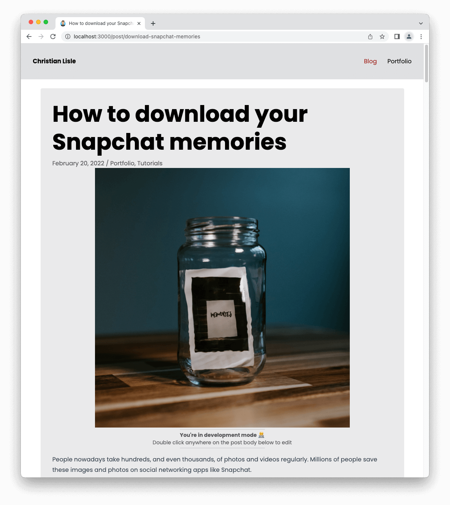
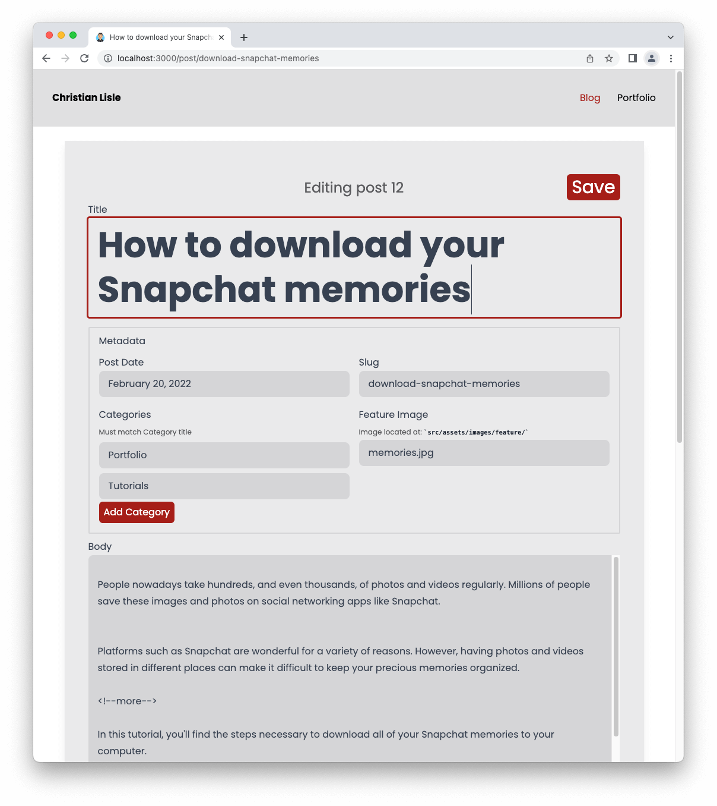

# Portfolio

Website for blogging and showcasing work. \
Built primarily with [NuxtJS](https://nuxtjs.org/) and [TailwindCSS](https://tailwindcss.com/).

<details>

<summary>Click here to see an example (<a href="http://www.cal-overflow.dev">cal-overflow.dev</a>)</summary>

View the source code for the website [here](https://github.com/cal-overflow/site)
#### Light mode
[](http://www.cal-overflow.dev)

#### Dark mode
[](http://www.cal-overflow.dev)

</details>

<!-- Table of contents -->
### Table of contents
- [Make the site your own](#make-the-site-your-own-)
  1. [Set environment variables](#1-set-environment-variables)
  2. [Enter a site description](#2-enter-a-site-description)
  3. [Replace essential content](#3-replace-essential-content)
  5. [Change the color palette](#4-change-the-color-palette)
  6. [Write your first blog post](#5-write-your-first-blog-post)
- [Blog posts](#blog-posts-)
- [Post tags](#post-tags)
- [Editing content in development mode](#editing-content-in-development-mode-)
- [Running locally](#running-locally) 
  - [Environment setup](#environment-setup)
  - [Environment variables](#environment-variables)
  - [Run or generate the website](#run-or-generate-the-website)
  - [Testing](#testing-)
    - [End-to-end test recording](#end-to-end-test-recording)

## Make the site your own 👨‍💻
This portfolio has been built to be "modular" so that most of the content is seperate from the components themselves.

If you'd like a website similar to mine ([cal-overflow.dev](http://www.cal-overflow.dev)), you can do so without needing to build it from scratch. Simply [use this repository as a template](https://docs.github.com/en/repositories/creating-and-managing-repositories/creating-a-repository-from-a-template#creating-a-repository-from-a-template) and follow the steps below.

### 1. Set environment variables

Reference the [Environment variables](#environment-variables) section.

### 2. Enter a site description

Find the `head` object within the `nuxt.config.js` file. Change the value of `content` in the object named `description`.

```diff
head: {
  meta: [
    // ...
    {
      hid: 'description',
      name: 'description',
-     content: "Enter your site description here."
+     content: "YOUR SITE DESCRIPTION"
    },
  ],
}
```

### 3. Replace essential content
Replace the essentials such as the bio and description of the blog/portfolio pages. Complete the following:

- [ ] Replace the existing `headshot.png` file within the `src/assets/images/` directory.
- [ ] Replace the existing `favicon.ico` file within the `src/static/` directory.
- [ ] Replace the contents of `about.md`, `blog-preview.md`, and `portfolio-preview.md` found within the `src/content/general/` directory.
- [ ] Enter a description for the Portfolio tag by editing the `description` attribute of `src/content/tags.yml`. Refer to the [Post tags](#post-tags) section.


### 4. Change the color palette
Change the color scheme of the website by editing `color` object within the `tailwind.config.js` file in the `src/` directory. You can find a small description for some of the properties below.

```js
colors: {
  'footer': '#292929',        // Background color of footer
  'menu-light': '#E0E0E1',    // Background color of menu bar in light mode
  'menu-dark': '#1F1F1F',     // Background color of menu bar in dark mode
  'card-light': '#EAEAEB',    // Background color of each card in light mode
  'card-dark': '#262626',     // Background color of each card in dark mode
  'primary-light': '#A61E17', // Primary color in light mode (red)
  'primary-dark': '#00B4E6',  // Primary color in dark mode (light blue)
  // ...
}
```

### 5. Write your first blog post

Now that you've done all the heavy lifting, your website should have a basic home page and be ready to serve some blog posts. Reference the [Blog Posts](#blog-posts-) section below for general information on writing a blog post.

---

## Blog posts 📝
Blog posts are written in [Markdown](https://www.markdownguide.org/) and converted to HTML with the [Nuxt Content](https://content.nuxtjs.org/) module.

To write a blog post, create a markdown file within a `src/content/posts/` directory. An [example post](http://www.cal-overflow.dev/post/download-snapchat-memories) is shown below.

```md
---
id: 12
title: How to download your Snapchat memories
slug: download-snapchat-memories
date: February 20, 2022
img: memories.jpg
tags:
  - Portfolio
  - Tutorials
---

People nowadays take hundreds, and even thousands, of photos and videos regularly. Millions of people save these images and photos on social networking apps like Snapchat.


Platforms such as Snapchat are wonderful for a variety of reasons. However, having photos and videos stored in different places can make it difficult to keep your precious memories organized.

<!--more-->

In this tutorial, you'll find the steps necessary to download all of your Snapchat memories to your computer.

...
```

View the Nuxt docs on [Writing Content](https://content.nuxtjs.org/writing) for a detailed explanation on how to write blog posts.

Note that feature images should be placed in directory `src/assets/images/feature/`. Other post images should be placed in `src/static/blog-images/`. Reference the [source code for cal-overflow.dev](https://github.com/cal-overflow/site) as an example.

## Post tags
Post tags allow you to group posts together based on similarities such as topic. Post tags are defined in a [YAML](https://yaml.org) file.

Tags should be defined within the `src/content/tags.yml` file. Each tag should contain a title, slug, and description attribute. Below is an example description written for the `Portfolio` tag.

```yaml
tags:
  - title: Portfolio
    slug: portfolio
    description: My most significant work and experiences. This varies from failed projects to fully functional apps, websites, games, and more.
```

Once a tag has been created, users can view all posts under that tag by visiting the endpoint `/tag/slug`, where `slug` is replaced by the value you set. For example, the tag defined in the example above is accesible by visting `/tag/portfolio`.

### Editing content in development mode 📃

When in a development environment, you can double click on `<nuxt-content>` components to edit the files in the browser.

I have created a [custom Editor component](src/components/development/Editor.vue) that builds upon the [default nuxt/content live editor](https://content.nuxtjs.org/displaying#live-editing). You can edit most content that is rendered with `<nuxt-content>` components.

<details>

<summary>View the editor in action</summary>

| Viewing post | Editing Post |
| :-: | :-: |
|  |  |

</details>

## Running locally
### Environment setup
First, navigate to the project directory and ensure you're using the correct version of Node. Then, install the Node dependencies with [npm](https://www.npmjs.com/).
```bash
$ cd portfolio

# ensure node version is correct
$ nvm use

# install dependencies
$ npm install
```

### Environment variables
Copy the contents below into a file called `.env`  and fill in the values as needed.

```text[.env]
NUXT_ENV_SITE_URL=
NUXT_ENV_FULL_NAME=
NUXT_ENV_EMAIL_ADDRESS=
NUXT_ENV_SITE_NAME=
NUXT_ENV_GITHUB_PROFILE_URL=
NUXT_ENV_YOUTUBE_CHANNEL_URL=
```
<details>
  <summary>The purpose of each environment variable</summary>


  | Variable | Description | Required |
  | ----: | ------ | :--: |
  | `SITE_URL` | Utilized by the RSS feed generator to let readers know where they can find your site. | ✅ |
  | `FULL_NAME` | Utilized throughout the site in places like the introduction "Hi. I'm ___." and the NavBar's home page title.  | ✅ |
  | `EMAIL_ADDRESS` | Utilized for contact requests. | ✅ |
  | `SITE_NAME` | Utilized by the site to change the site title. If left blank, the `FULL_NAME` value is used. |  |
  | `GITHUB_PROFILE_URL` | When present, a link to GitHub is shown in the FooterBar. |  |
  | `YOUTUBE_CHANNEL_URL` | When present, a link to Youtube is shown in the FooterBar. |  |

  Note that each environment variable name is preceded by `NUXT_ENV_` so that it is easily accessible by the nuxt application. Refer to Nuxt's [Environment Variables documentation](https://nuxtjs.org/docs/configuration-glossary/configuration-env/#automatic-injection-of-environment-variables).
</details>

### Run or generate the website
Once you've installed the necessary Node modules and configured your environment variables, you can run the application. Run the application using the command that is most appropriate for your environment.

```bash
# serve with hot reload at localhost:3000 - ideal for development
$ npm run dev

# generate static site files
$ npm run generate

# serve the static site
$ npm run start
```


### Testing 🧪

Unit tests can be run with the [Jest](https://jestjs.io/) test runner. End-to-end tests are run with [Cypress](https://www.cypress.io/).

```bash
# run unit tests
$ npm run unit

# run e2e tests
$ npm run e2e

# run e2e in headless mode
$ npm run e2e:headless

# run e2e by connecting to an already-running server
$ npm run e2e:live
``` 

#### End-to-end test recording
Cypress enables for recording your tests. This is ideal for CI/CD, since it allows you to view and troubleshoot recordings of failed tests. \
If you would like to enable e2e test recording,  follow the steps below.

##### 1. Create a Cypress project
Follow the [Cypress project documentation](https://docs.cypress.io/guides/dashboard/projects#Set-up-a-project-to-record) to create a Cypress project for your website.

##### 2. Enter Cypress project ID
Enter your Project ID in the `projectId` field of [`cypress.json`](cypress.json).

##### 3. Copy the project record key
From your Cypress project dashboard, Copy a "Record Key" and paste it into in an environment variable called `CYPRESS_RECORD_KEY`.

##### 4. Run tests with recording enabled
Now, you can run one of the following commands and the e2e tests will be recorded. The recordings are accessible on your Cypress project dashboard.

```bash
# run only e2e tests (recording enabled)
$ npm run e2e:deploy

# run unit and e2e tests (recording enabled)
$ npm run test:deploy
```

#### Updating your website with new features in the template

If you want to bring new changes from the template repository into your website, utilize mutliple remote repositories with Git.

```bash
git remote add template <git@github.com:cal-overflow/portfolio.git>
# OR
git remote add template <https://github.com/cal-overflow/portfolio.git>

git fetch --all
git merge template/master
```
